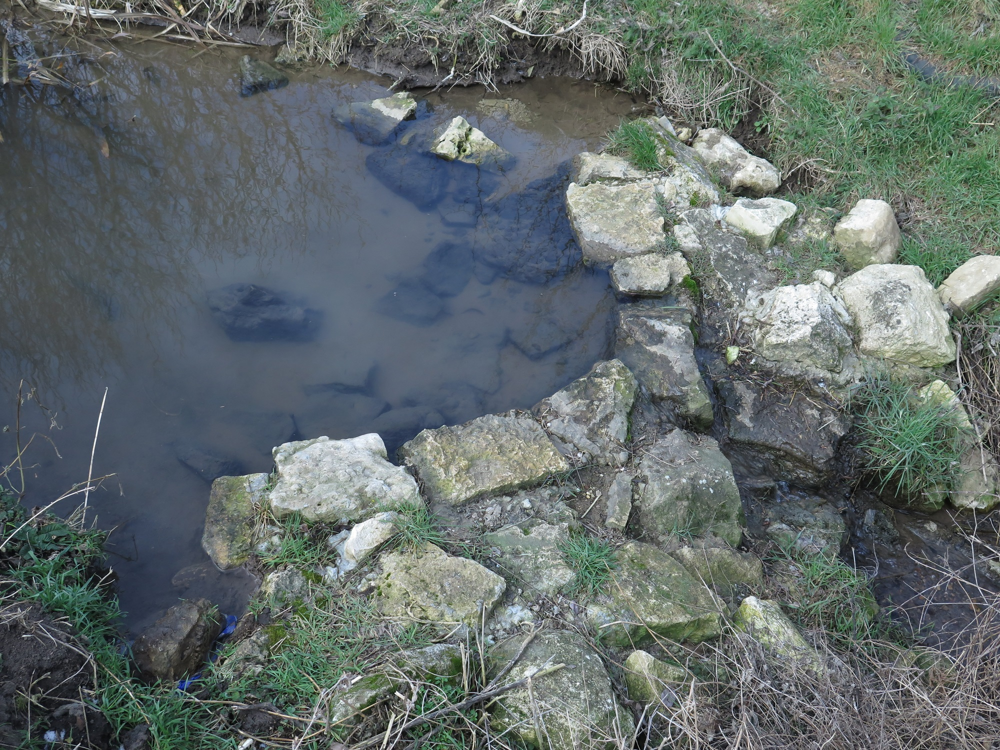
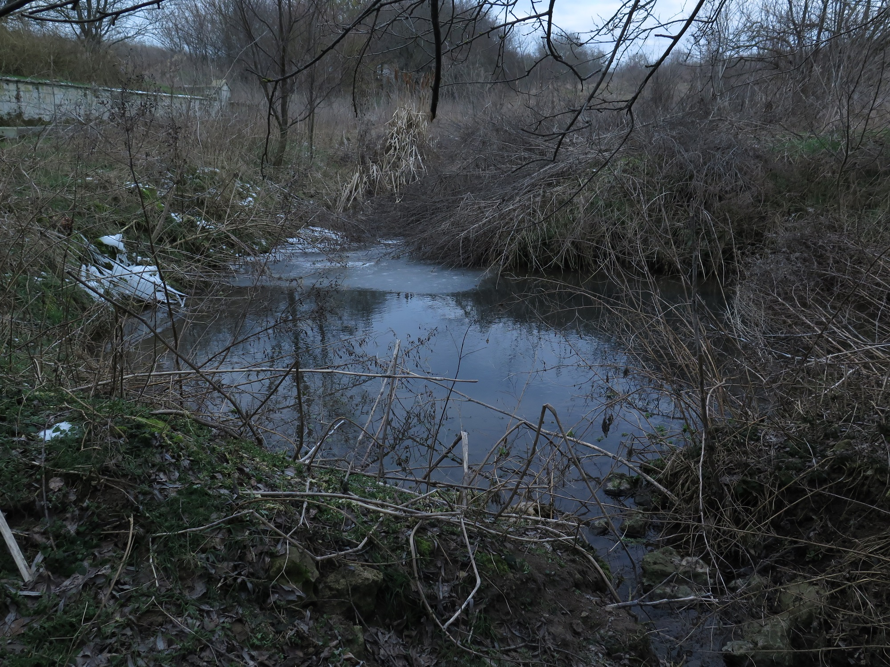
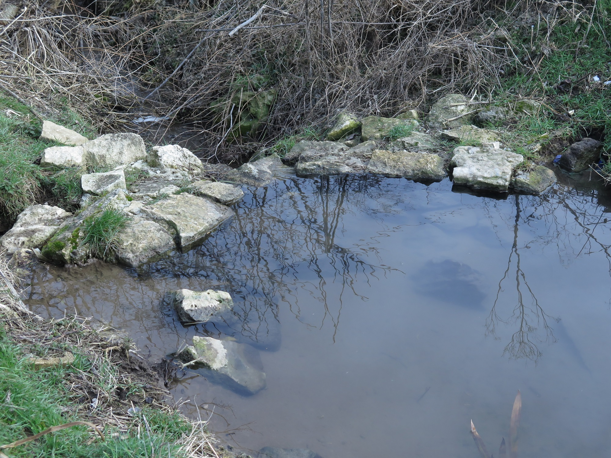
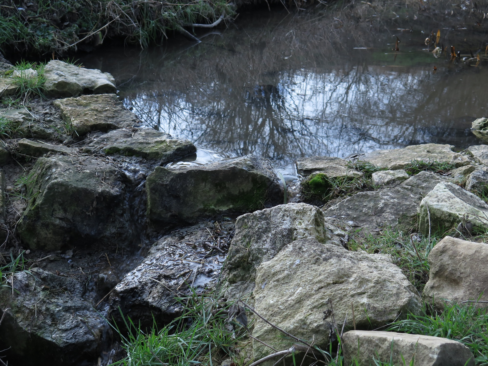

+++
title = 'Възстановяване на Топчийка'
image = 'топчийка.jpg'
weight = 2
author = 'Весел Огън'
+++

Моят опит в цифри.

Начало 2019 март построих първи малък бент.

Aкумулирана вода при него около 2 кубика. Чешмата, на която се направи работеше с около 600л на час дебит. Това е много малко при спомените, които имахме за нея (коритата едва хващаха водата тогава). Засадих блатен аир, ботомис, водна мента, другото го имаше. В нашия район беше тотална пролетна суша - поливах пролетни цветя в градината онази пролет. Никакъв дъжд или сняг 2 месеца след това. Май месец замерих, дебитът бе скочил на 850л на час.

Краят на май имах възможност да заделя средства и поканих багер, за да изкопае езеро, преди малкият бент.

Много бях доволен, стана голямо, отне два дена да се пълни. Направих стена, но бе компромисна и след една седмица се изля потоп като помете всичко от нея, а езерото се запълни наполовина с пръст от нивите на Агро-людете. Малкият бент по-долу обаче издържа. Оставих нещата така: с езеро наполовина и малък бент, като продължих да работя по другите точки.

Краят на месец Юли замерване дебит 1250л на час. Растителността растеше, а с нея и дейности около бента от животинки.
Дебитът остана на това ниво до края на годината без да пада или да се влияе от времето (като изключим ежедневната флуктуация поради дишането на планетата)

2021-ва все същият дебит до АВГУСТ, когато о... чудо. След нещо като взрив от самата чешма (само така мога да го нарека) от 1250л скочи на 2800-3000л и сега варира в тези рамки.

През вечер, ако не и всяка, съм бил при нея (чешмата). Разговарях се с нея като с малко дете, пях и песни, говорих ѝ какво ли не беше.
Този август няма да го забравя и го пожелавам на всички Ви.

Трябва да запазим повърхностните води, ако можех да ви предам колко важно е това. Ако ги изгубим, успокоявайки се с идеята че ще правим кладенци, шамарът ще е голям. Никакви кладенци тук в България няма да останат ако пропилеем водата отгоре. Нашата страна е МНОГО особена в това отношение. Не разчитайте на подземни води ако се подиграем с тези отгоре. Подземната вода ще изчезне с много малък толеранс след тази отгоре, така че ви умолявам действайте и не се интерисувайте какво ви дрънкат невежите безверници наоколо. Веднъж успели, ще разберете. Ще се видим с вас на брега на постижението, за да има какво да си кажем и какво още да свършим. Успех!!!

